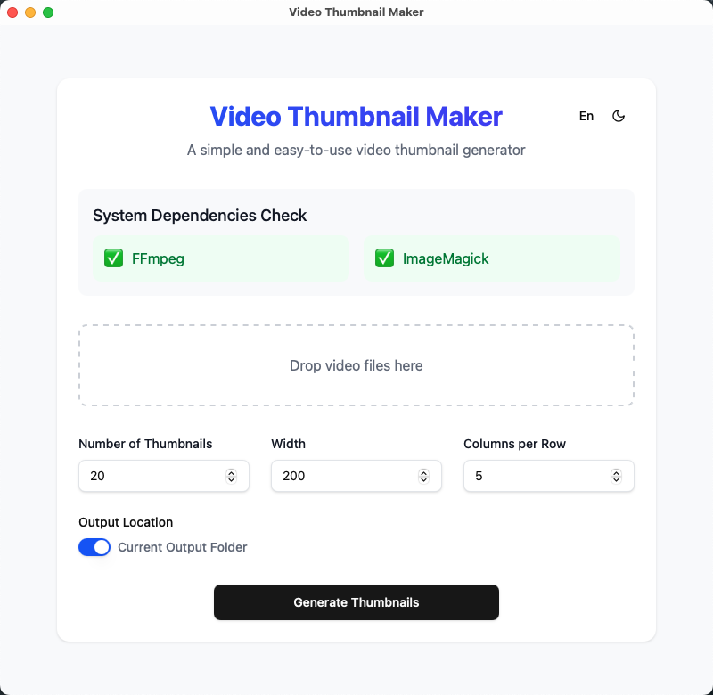

# Video Thumbnail Maker

English | [简体中文](./README.zh-CN.md)

A simple and easy-to-use video thumbnail generator that quickly extracts multiple frames from videos and generates preview images.



## Generated Result


## Features

- 🎬 Support for multiple video formats
- 🖼️ Customizable thumbnail count and size
- 📐 Flexible layout configuration
- 🚀 Fast batch processing
- 🎯 Simple and intuitive drag-and-drop operation
- 🌓 Dark mode support
- 💾 Automatic settings save
- 📊 Real-time processing progress display
- 🌍 Bilingual interface (English/Chinese)

## System Requirements

This tool requires the following dependencies:

- FFmpeg - For video processing and frame extraction
- ImageMagick - For image composition

### Installing Dependencies

**macOS**:
```bash
brew install ffmpeg imagemagick
```

**Windows**:
1. FFmpeg: Download from [FFmpeg Official Website](https://ffmpeg.org/download.html) and add to system PATH
2. ImageMagick: Download installer from [ImageMagick Official Website](https://imagemagick.org/script/download.php)

**Linux**:
```bash
# Ubuntu/Debian
sudo apt-get install ffmpeg imagemagick

# CentOS/RHEL
sudo yum install ffmpeg imagemagick
```

## Usage Instructions

1. Upon launching the application, it will first check if the necessary dependencies (FFmpeg and ImageMagick) are installed
2. Set generation parameters:
   - Screenshot count: Determines how many frames to extract from the video
   - Thumbnail width: Sets the width of each thumbnail (height will adjust proportionally)
   - Thumbnails per row: Sets the number of thumbnails to display per row in the final composite image
3. Drag and drop video files into the application window to start processing
4. Once processing is complete, find the generated preview image in the specified output directory

## Development

This project uses the following technology stack:

- Tauri - Cross-platform application framework
- React - Frontend UI framework
- TypeScript - Type-safe JavaScript superset
- Tailwind CSS - Utility-first CSS framework
- i18next - Powerful internationalization solution

### Development Environment Setup

```bash
# Install dependencies
pnpm install

# Start development server
pnpm tauri dev

# Build application
pnpm tauri build
```

### Internationalization Development

This project uses i18next for internationalization support, with language files located in the `src/i18n` directory. To add support for a new language, follow these steps:

1. Create a new language file in the `src/i18n` directory
2. Register the new language in `src/i18n/i18next.ts`
3. Use the `useTranslation` hook to implement text translation in components

## License

MIT License
